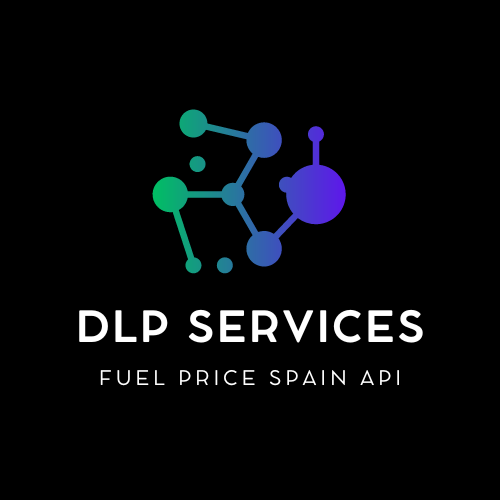

# FuelPriceSpainAPI

<p align="center">
  
</p>

## Español.

FuelPriceSpainAPI es una API RESTful basada en [Fastify](https://fastify.dev) que proporciona información actualizada sobre los precios de combustible en estaciones de servicio en toda España. Esta API está containerizada utilizando [Docker](https://www.docker.com) y utiliza [PostgreSQL](https://www.postgresql.org) como su base de datos. La aplicación incluye varios endpoints para acceder a los datos de precios de combustible, los cuales se pueden explorar a través de la documentación disponible en `/docs`.

## Características

- **Datos en Tiempo Real**: Recupera automáticamente los últimos precios de combustible del [sitio web oficial del gobierno de españa](https://datos.gob.es/es/catalogo/e05068001-precio-de-carburantes-en-las-gasolineras-espanolas) dos veces al día.
- **Cobertura Integral**: Incluye datos de estaciones de servicio en todas las provincias de España.
- **Containerizado**: Totalmente containerizado utilizando [Docker](https://www.docker.com) para una fácil implementación y escalabilidad.
- **Documentación Detallada**: La documentación de la API se proporciona mediante [Scalar](https://docs.scalar.com), accesible en `/docs`.

## Prerrequisitos

- [Docker](https://www.docker.com)
- [Docker compose](https://docs.docker.com/compose/)
- [Make](https://www.gnu.org/software/make/manual/make.html)
- [Node](https://nodejs.org/en)

## Comenzando

### Instalación

1. **Clona el repositorio**:

   ```bash
   git clone https://github.com/ismaelpzex/fuel-price-spain-api.git
   cd fuel-price-spain-api
   ```

2. Crea un archivo `.env` en el directorio raíz con el siguiente contenido:

   ```bash
   POSTGRES_USER=example
   POSTGRES_PASSWORD=example
   POSTGRES_DB=db
   POSTGRES_HOST=database
   ```

### Uso

#### Construir y Arrancar la Aplicación

Para construir y arrancar los contenedores [Docker](https://www.docker.com) , usa los siguientes comandos:

Construir los contenedores:

```bash
make build
```

#### Administrar la Aplicación

Detener los contenedores:

```bash
make stop
```

Detener y limpiar (incluyendo el contenido de la base de datos):

```bash
make clean
```

#### Acceso a la API

Documentación de la API: Visita `/docs` para explorar los endpoints disponibles y su uso.

#### Obtención Automática de Datos

La aplicación recupera automáticamente los últimos precios de combustible del [sitio web oficial del gobierno de españa](https://datos.gob.es/es/catalogo/e05068001-precio-de-carburantes-en-las-gasolineras-espanolas) dos veces al día para asegurar que la base de datos esté actualizada.

#### Documentación Scalar

La documentación detallada de la API se proporciona a través de [Scalar](https://docs.scalar.com). Explora y prueba los endpoints disponibles a través de la documentación en `/docs`.

### Visión General Rápida

- **URL Base**: `/api/v1`

- **Endpoints**:

  - **GET** `/nearest-gas-stations` - Recupera las estaciones de servicio más cercanas en función de las coordenadas proporcionadas.

    - **Parámetros de Consulta**:
      - `lon` (requerido) - Longitud de la ubicación.
      - `lat` (requerido) - Latitud de la ubicación.
      - `distance` (opcional) - Distancia máxima desde la ubicación en metros. Por defecto es 5000 metros si no se proporciona.

    **Ejemplo de Solicitud**:

    ```bash
    curl -X GET "http://api.example.com/api/v1/nearest-gas-stations?lon=-3.70379&lat=40.41678&distance=10000"
    ```

  - **GET** `/stations/:id` - Recupera los detalles de una estación de servicio por su ID.

    - **Parámetros de Ruta**:
      - `id` (requerido) - El UUID de la estación de servicio.

    **Ejemplo de Solicitud**:

    ```bash
    curl -X GET "http://api.example.com/api/v1/stations/f47ac10b-58cc-4372-a567-0e02b2c3d479"
    ```

    - **GET** `/stations/location/:location` - Recupera las estaciones de servicio por localidad.
    - **Parámetros de Ruta**:
      - `location` (requerido) - La ubicación de la estación de servicio.

    **Ejemplo de Solicitud**:

    ```bash
    curl -X GET "http://api.example.com/api/v1/stations/location/Madrid"
    ```

    - **GET** `/stations/municipality/:municipality` - Recupera las estaciones de servicio por municipio.

    - **Parámetros de Ruta**:
      - `municipality` (requerido) - La ubicación de la estación de servicio.

    **Ejemplo de Solicitud**:

    ```bash
    curl -X GET "http://api.example.com/api/v1/stations/municipality/Madrid"
    ```

    - **GET** `/stations/province/:province` - Recupera las estaciones de servicio por provincia.

    - **Parámetros de Ruta**:
      - `province` (requerido) - La ubicación de la estación de servicio.

    **Ejemplo de Solicitud**:

    ```bash
    curl -X GET "http://api.example.com/api/v1/stations/province/Madrid"
    ```

    - **GET** `/fuel-type/:fuelType` - Recupera las estaciones de servicio por tipo de combustible.

    - **Query Parameters**:
      - `fuelType` (requerido) - El tipo de combustible de la estación de servicio. Los valores permitidos son: "biodiesel", "bioetanol", "gas-natural-comprimido", "gas-natural-licuado", "gases-licuados-del-petroleo", "gasoleo-a", "gasoleo-b", "gasoleo-premium", "gasolina-95-e10", "gasolina-95-e5", "gasolina-95-e5-premium", "gasolina-98-e10", "gasolina-98-e5", "hidrogeno". Se pueden enviar múltiples valores separados por comas.

    **Ejemplo de Solicitud**:

    ```bash
    curl -X GET "http://api.example.com/api/v1/fuel-type/gasolina-95-e5,gasoleo-a"
    ```

    - **GET** `/get-nearly-gas-stations-by-fuel-type"` - Recupera las estaciones de servicio más cercanas a una ubicación específica y las filtra por tipos de combustible.

    - **Query Parameters**:
      - `lat` (requerido) - La latitud de la ubicación.
      - `lon` (requerido) - La longitud de la ubicación.
      - `distance` (opcional) - El radio de búsqueda en kilómetros. El valor predeterminado es 5 kilómetros.
      - `fuelType` (opcional) - El tipo de combustible de la estación de servicio. Los valores permitidos son: "biodiesel", "bioetanol", "gas-natural-comprimido", "gas-natural-licuado", "gases-licuados-del-petroleo", "gasoleo-a", "gasoleo-b", "gasoleo-premium", "gasolina-95-e10", "gasolina-95-e5", "gasolina-95-e5-premium", "gasolina-98-e10", "gasolina-98-e5", "hidrogeno". Se pueden enviar múltiples valores separados por comas.

    **Ejemplo de Solicitud**:

    ```bash
    curl -X GET "http://api.example.com/api/v1/nearest-gas-stations?lat=40.4165&lon=-3.70256&distance=10&fuelType=gasolina-95-e5,gasoleo-a"
    ```

## Licencia

Este proyecto está licenciado bajo la Licencia MIT - consulta el archivo [LICENSE](./LICENSE) para más detalles.

## Contribución

¡Las contribuciones son bienvenidas! Por favor, consulta nuestro archivo [CONTRIBUTING.md](./CONTRIBUTING.md) para instrucciones detalladas sobre cómo hacer fork el repositorio, crear una PR y asegurarte de que tu código se ajuste al estilo existente e incluya tests aadecuados.

## Contacto

Para cualquier pregunta o sugerencia, por favor abre una issue o contacta a [ismaelpzex@gmail.com](mailto:ismaelpzex@gmail.com).

## English.

FuelPriceSpainAPI is a [Fastify](https://fastify.dev) based RESTful API that provides up-to-date information on fuel prices at gas stations across Spain. This API is containerized using [Docker](https://www.docker.com) and leverages PostgreSQL as its database. The application includes several endpoints for accessing fuel price data, which can be explored via the documentation available at `/docs`.

## Features

- **Real-Time Data**: Automatically fetches the latest fuel prices from the [official Spanish goverment website](https://datos.gob.es/es/catalogo/e05068001-precio-de-carburantes-en-las-gasolineras-espanolas) twice a day.
- **Comprehensive Coverage**: Includes data from gas stations across all provinces in Spain.
- **Containerized**: Fully containerized using [Docker](https://www.docker.com) for easy deployment and scalability.
- **Detailed Documentation**: API documentation is provided using [Scalar](https://docs.scalar.com), accessible at `/docs`.

## Prerequisites

- [Docker](https://www.docker.com)
- [Docker compose](https://docs.docker.com/compose/)
- [Make](https://www.gnu.org/software/make/manual/make.html)
- [Node](https://nodejs.org/en)

## Getting Started

### Installation

1. **Clone the repository**:

   ```bash
   git clone https://github.com/ismaelpzex/fuel-price-spain-api.git
   cd fuel-price-spain-api
   ```

2. Create a `.env` file in the root directory with the following content:

   ```bash
   POSTGRES_USER=example
   POSTGRES_PASSWORD=example
   POSTGRES_DB=db
   POSTGRES_HOST=database
   ```

### Usage

#### Build and Start the Application

To build and start the [Docker](https://www.docker.com) containers, use the following commands:

Build the containers:

```bash
make build
```

Start the containers:

```bash
make start
```

#### Manage the Application

Stop the containers:

```bash
make stop
```

Stop and clean up (including database content):

```bash
make clean
```

#### Accessing the API

API Documentation: Visit `/docs` to explore available endpoints and their usage.

#### Automatic Data Fetch

The application automatically fetches the latest fuel prices from the official [official Spanish goverment website](https://datos.gob.es/es/catalogo/e05068001-precio-de-carburantes-en-las-gasolineras-espanolas) twice a day to ensure the database is up-to-date.

#### Scalar Documentation

Detailed API documentation is provided through [Scalar](https://docs.scalar.com). Explore and test the available endpoints via the documentation at `/docs`.

### Quick Overview

- **Base URL**: `/api/v1`

- **Endpoints**:

  - **GET** `/nearest-gas-stations` - Retrieves the nearest gas stations based on provided coordinates.

    - **Query Parameters**:
      - `lon` (required) - Longitude of the location.
      - `lat` (required) - Latitude of the location.
      - `distance` (optional) - Maximum distance from the location in meters. Defaults to 5000 meters if not provided.

    **Example Request**:

    ```bash
    curl -X GET "http://api.example.com/api/v1/nearest-gas-stations?lon=-3.70379&lat=40.41678&distance=10000"
    ```

  - **GET** `/stations/:id` - Retrieves the details of a gas station by its ID.

    - **Path Parameters**:
      - `id` (required) - The UUID of the gas station.

    **Example Request**:

    ```bash
    curl -X GET "http://api.example.com/api/v1/stations/f47ac10b-58cc-4372-a567-0e02b2c3d479"
    ```

  - **GET** `/stations/location/:location` - Retrieves gas stations by location.

    - **Path Parameters**:
      - `location` (required) - The location of the gas station.

    **Example Request**:

    ```bash
    curl -X GET "http://api.example.com/api/v1/stations/location/Madrid"
    ```

    - **GET** `/stations/municipality/:municipality` - Retrieves gas stations by municipality.

    - **Path Parameters**:
      - `municipality` (required) - The municipality of the gas station.

    **Example Request**:

    ```bash
    curl -X GET "http://api.example.com/api/v1/stations/municipality/Madrid"
    ```

    - **GET** `/stations/municipality/:province` - Retrieves gas stations by province.

    - **Path Parameters**:
      - `province` (required) - The province of the gas station.

    **Example Request**:

    ```bash
    curl -X GET "http://api.example.com/api/v1/stations/province/Madrid"
    ```

    - **GET** `/fuel-type/:fuelType` - Retrieves gas stations by fuel type.

    - **Path Parameters**:
      - `fuelType` (required) - The fuel type of the gas station. Allowed values are: "biodiesel", "bioetanol", "gas-natural-comprimido", "gas-natural-licuado", "gases-licuados-del-petroleo", "gasoleo-a", "gasoleo-b", "gasoleo-premium", "gasolina-95-e10", "gasolina-95-e5", "gasolina-95-e5-premium", "gasolina-98-e10", "gasolina-98-e5", "hidrogeno". Multiple values can be sent separated by commas.

    **Example Request**:

    ```bash
    curl -X GET "http://api.example.com/api/v1/fuel-type/gasolina-95-e5,gasoleo-a"
    ```

    - **GET** `/get-nearly-gas-stations-by-fuel-type` - Retrieves the nearest gas stations to a specific location and filters them by fuel types.

    - **Query Parameters**:
      - `lat` (required) - The latitude of the location.
      - `lon` (required) - The longitude of the location.
      - `distance` (optional) - The search radius in kilometers. The default value is 5 kilometers.
      - `fuelType` (optional) - The fuel type of the gas station. Allowed values are: "biodiesel", "bioethanol", "compressed-natural-gas", "liquefied-natural-gas", "liquefied-petroleum-gases", "diesel-a", "diesel-b", "premium-diesel", "gasoline-95-e10", "gasoline-95-e5", "gasoline-95-e5-premium", "gasoline-98-e10", "gasoline-98-e5", "hydrogen". Multiple values can be sent separated by commas.

    **Request Example**:

    ```bash
    curl -X GET "http://api.example.com/api/v1/nearest-gas-stations?lat=40.4165&lon=-3.70256&distance=10&fuelType=gasoline-95-e5,diesel-a"
    ```

## License

This project is licensed under the MIT License - see the [LICENSE](./LICENSE) file for details.

## Contributing

Contributions are welcome! Please refer to our [CONTRIBUTING.md](./CONTRIBUTING.md) file for detailed instructions on how to fork the repository, create a pull request, and ensure your code adheres to the existing style and includes appropriate tests.

## Contact

For any questions or suggestions, please open an issue or contact [ismaelpzex@gmail.com](mailto:ismaelpzex@gmail.com).

## Topics

### English

- Fuel Price API
- Gasoline Price API
- Fuel Price Data
- Fuel Price Lookup
- Gasoline Price Lookup
- Fuel Pricing Information
- Gas Station Prices
- Fuel Cost API
- Petrol Price API
- Diesel Price API
- Gas Price API Spain
- Spain Fuel Prices
- Spanish Fuel Prices
- Gas Stations Spain
- Fuel Stations Spain
- Fuel Price Data Spain
- Gasoline Stations Spain
- Diesel Stations Spain
- Fuel Prices by Region Spain
- Gas Prices by Province Spain
- RESTful API
- Fastify API
- JSON API
- API Integration
- Real-Time Fuel Data
- API Endpoints
- API Documentation
- Web API
- API Data Access
- API Development
- API for Developers
- Node.js API
- Fuel Price Tracking
- Fuel Price Updates
- Real-Time Gas Prices
- Gasoline Cost Tracker
- Diesel Cost Tracker
- Fuel Price Comparison Tool
- Find Gas Prices
- Compare Fuel Prices
- Fuel Price Alerts
- Location-Based Fuel Prices
- For Developers
- For Businesses
- Fuel Price API for Apps
- Fuel Price Data for Websites
- Fuel Pricing for Enterprises
- Energy Management API
- Fuel Cost Management
- Fleet Management Fuel Prices
- Easy API Integration
- Accurate Fuel Prices
- Reliable Fuel Data
- Fast API Response
- Scalable Fuel API
- Fuel API for Mobile Apps
- Fuel API for Web Services
- Customizable Fuel Pricing API
- Fuel Price Trends
- Fuel Price Insights
- Gasoline Price Trends
- Diesel Price Insights
- Fuel Market Data
- Fuel Economy
- Energy Prices
- Gasoline Cost Trends
- Diesel Cost Trends
- Best Fuel Price API
- Top Fuel Price API
- Fuel Price API for Developers
- Reliable Gas Price Data
- Comprehensive Fuel Price API
- Efficient Fuel Pricing Solution
- Affordable Fuel Data API
- Innovative Fuel Price API
- Fuel Price API for Startups
- Fuel Price API for Developers
- Industry-Leading Fuel Price API
- Fast Fuel Price Updates
- Accurate Gas Price Information
- Nationwide Fuel Price Coverage
- Advanced Fuel Price API

### Español

- API de Precios de Combustible
- API de Precios de Gasolina
- Datos de Precios de Combustible
- Consulta de Precios de Combustible
- Consulta de Precios de Gasolina
- Información sobre Precios de Combustible
- Precios de Gasolineras
- API de Costo de Combustible
- API de Precio de Petróleo
- API de Precio de Diésel
- API de Precios de Gas en España
- Precios de Combustible en España
- Precios de Combustible en España
- Gasolineras en España
- Estaciones de Combustible en España
- Datos de Precios de Combustible en España
- Estaciones de Gasolina en España
- Estaciones de Diésel en España
- Precios de Combustible por Región en España
- Precios de Gas por Provincia en España
- API RESTful
- API Fastify
- API JSON
- Integración de API
- Datos de Combustible en Tiempo Real
- Endpoints de API
- Documentación de API
- API Web
- Acceso a Datos de API
- Desarrollo de API
- API para Desarrolladores
- API Node.js
- Seguimiento de Precios de Combustible
- Actualizaciones de Precios de Combustible
- Precios de Gas en Tiempo Real
- Rastreador de Costo de Gasolina
- Rastreador de Costo de Diésel
- Herramienta de Comparación de Precios de Combustible
- Encontrar Precios de Gas
- Comparar Precios de Combustible
- Alertas de Precios de Combustible
- Precios de Combustible Basados en Ubicación
- Para Desarrolladores
- Para Empresas
- API de Precios de Combustible para Aplicaciones
- Datos de Precios de Combustible para Sitios Web
- Precios de Combustible para Empresas
- API de Gestión de Energía
- Gestión de Costos de Combustible
- Precios de Combustible para Gestión de Flotas
- Integración de API Fácil
- Precios de Combustible Precisos
- Datos de Combustible Fiables
- Respuesta Rápida de API
- API de Combustible Escalable
- API de Combustible para Aplicaciones Móviles
- API de Combustible para Servicios Web
- API de Precios de Combustible Personalizable
- Tendencias de Precios de Combustible
- Perspectivas de Precios de Combustible
- Tendencias de Precios de Gasolina
- Perspectivas de Precios de Diésel
- Datos del Mercado de Combustible
- Economía de Combustible
- Precios de Energía
- Tendencias de Costo de Gasolina
- Tendencias de Costo de Diésel
- Mejor API de Precios de Combustible
- API de Precios de Combustible Más Popular
- API de Precios de Combustible para Desarrolladores
- Datos Fiables de Precios de Gas
- API de Precios de Combustible Integral
- Solución Eficiente de Precios de Combustible
- API de Datos de Combustible Asequible
- API de Precios de Combustible Innovadora
- API de Precios de Combustible para Nuevas Empresas
- API de Precios de Combustible para Desarrolladores
- API de Precios de Combustible Líder en la Industria
- Actualizaciones Rápidas de Precios de Combustible
- Información Precisa sobre Precios de Gas
- Cobertura Nacional de Precios de Combustible
- API Avanzada de Precios de Combustible
